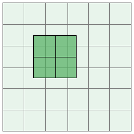

## What are convolutions?

Before we answer this, let's understand one thing first. Computers are dumb creatures. They don't know what words mean, like cat or dog. They don't know what things look like, like a cat or a dog. All they understand are numbers (well... slightly not true, but for our case it works). 

Now let's introduce a few terms ~ ***kernel***, ***filters*** and ***channels***. 

*Filters* can be thought of as a collection of *kernels*.

But what *are* kernels?

Imaging you're on the set of your favourite tv-show. We'll take Game of Thrones for now, but any show works. Kernels are each individual actor, writer, cinematographer, etc on that show.

*kernels sitting across a table, trying to decide the course of the season*

And since computers don't understand anything other than numbers, kernels for us are just numbers. Each kernel is a matrix of numbers. Now if a Game of Thrones episode is analogous to a neural network trying to distinguish between a cat or a dog, kernels are the individual actors that helped it reach its decision.

In case of Convolutional Neural Networks (CNN) kernels behave as *feature* *extractors*. The extract certain features from the data, and pass it along to the next layer, which ultimately helps in arriving at a decision.

Thinking of kernels as feature extractors brings us to channels. *Channels* can be thought of now as feature bags. A "bag" contains the same set of features. 

A colour image usually has three channels - Red, Green, and Blue (RGB image). The Red channel contains similar set of features about the image that describes the "redness" of it. Same for the Green and Blue channels.

In case of Game of Thrones, channels can be thought of as a department - the sound department can be thought of as a channel, similarly the video department, marketing department can be the other channels.

We now come to ***convolutions***.

*fig. 1: an example of 2D convolution of a 3x3x1 kernel on 5x5x1 data*

In convolution, we take a kernel of dimenstion (width, height, channel) e.g. 3x3x1 and slide it across our data, performing elementwise multiplication over the part of the input it is currently on, and summing up the results into get the output element.

In the image above, a 3x3x1 kernel is convolving over 5x5x1 input data. This is also known as 2D Convolution 

*Note: The number of channels a kernel has needs to be the same as the number of channels in the input data. Now based on the number of kernels we use, the output data's channels get decided. e.g. if our input data is of size 7x71, our kernel must have 1 channel, like 3x3x1. Now if we use 32 such kernels, the output data's size will be something like 5x5x32 (it will have 32 channels) If we further want to convolve, we must use kernels with 32 channels, e.g. 3x3x32.*

*fig. 3: convolution of 4 kernels of shape 3x3x3 on data of size 5x5x3 to get output of  shape 3x3x4*

## Why don't we use even shaped kernels like 2x2, 4x4, 6x6 ?

When we have a kernel like 3x3 or 5x5, the kernel lies on top of a pixel, and it has a symmetrical view of the neighbouring pixels. There is a central element and a symmetry around this.

*fig. 3: convolving with a 2x2 kernel has a non-symmetrical view of the pixels below it.*

We completely lose this symmetry if it's any even shaped kernel. The kernel doesn't know which pixel's local features it is extracting. If we do something like edge detection, there needs to be a central element, which has something to it's left and something to it's right - preferably with uniform similarity. If it's not there, it results in distortions for the output the kernel produces. Which is why we avoid using kernels like 2x2, 4x4, 6x6, etc.

## Why do we usually use 3x3 kernels and not 1x1, 5x5, 7x7, etc?

In a Convolutional Neural Network, we usually think of kernels as feature extractors. When we use a 1x1 kernel, the "view" of the kernel is very limited - it would just be the element right below the kernel. From fig.1. above, we see that when we use a 3x3 kernel, the "view" of the kernel when it is above a pixel is of 9 pixels below it. We are seeing more of the data, this helps us extract better features.

If it's a 1x1 kernel, it behaves like an identity function, which is useless to us when extracting features.

The next odd shaped kernel is 3x3 (we discussed why we don't use even shaped ones above).

3x3 kernel behaves perfectly as a feature extractor. It has a central element and a symmetry around it. It covers enough area to have local knowledge useful for extracting features, so it works for us.

5x5, 7x7 and others also have symmetry around pixels, but while convolving they have more parameters than when convolving with a 3x3 kernel, so the larger we go from 3x3, the less computationally effecient it becomes. The local area it covers is also larger than we want it to be, when extracting features. 3x3 gives us a good coverage of pixels.

Another advantage with using 3x3 kernels is we can get the same affect of any odd shaped kernel with a 3x3 kernel. For example, we can use two 3x3 kernels to get the same effect as using a 5x5 kernel (with no padding and stride of 1).

By affect, we mean receptive field, or the "view" we mentioned earlier. Using 2 3x3 kernels gives us the same global receptive field as using 1 5x5 kernel, and still using 3x3 is more computationally effecient in this case!

Because of all these advantages, GPU's like those by NVIDIA have also optimized convolutions on 3x3 sized kernels. Many papers like the Resnet paper has 7x7 kernel in it's code, but while optimizing the performance of such networks, the 7x7 kernels get converted into 3 3x3 kernels.

So we stick to using 3x3 kernels when we want to extract features.

*Note: We do use 1x1 convolutions in our networks, but we don't use them for extracting features. They are typically used to increase/decrease the number of channels. We can use 3x3 for changing the number of channels, but it behave as normal convolution too, so changing the pixel values as well. 1x1, being an identity mapping, doesn't do the usual convolution, so it's an ideal kernel when we just want to change the number of channels.*

