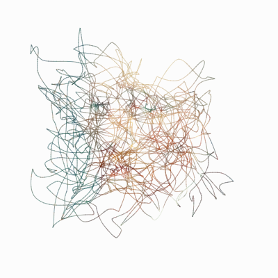
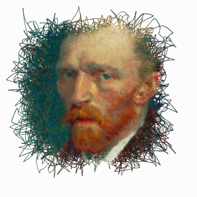
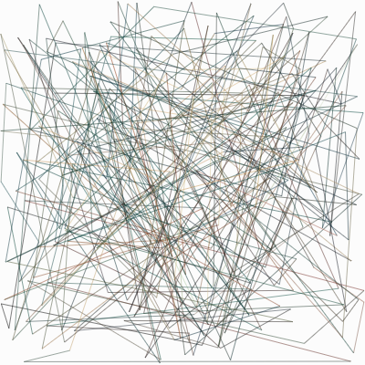
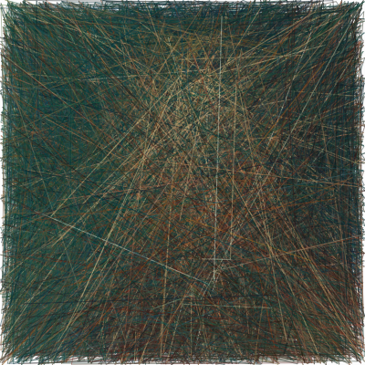
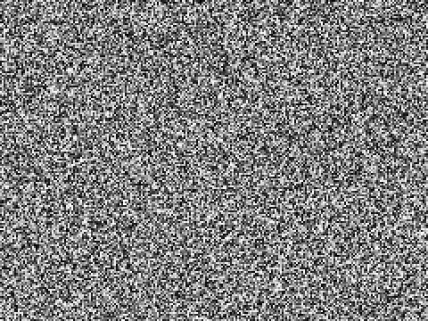
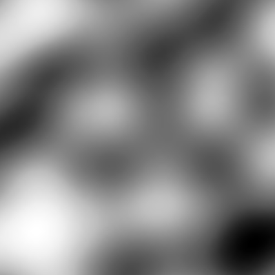

*A bunch of random, squiggly lines being drawn to generate a portrait of Van Gogh.*

The above method uses two concepts - **Random Walk**, and **Perlin Noise**.

Imagine you are walking down an empty road, it's a holiday, and you have all the time in the world. Every 10 seconds, you flip a coin. Heads, you take a step forward. Tails, it's a step backward. This is essentially what a random walk is - a path defined by a series of random steps.

Now instead of an empty road, suppose it's a maze, where you have options to take a step to your left and right, along with forward and backward directions. So now you take 2 coins and based on their flip you decide a step direction, e.g. if it is Head and Head, maybe you take 1 step forward, 1 step left, and so on.

This is similar to what the algorithm above is doing. Lines are drawn between two points - starting from an initial point, `(x1, y1)` the destination point `(x2, y2)` is chosen based on some randomness. In the next iteration, the initial point now becomes the past `(x2, y2)` and the whole thing repeats all over again.

To get the colour, we take the rgb value of the destination point here `(x2, y2)`. We could take the initial pixel value as well, but since the distance between the points are large, and a lot of times it starts from the background, taking the destination pixel value made more sense. Purely a personal preference.

Now we come to the randomness part.

Almost all programming languages and libraries have a *random()* function. We could have used that to get a random direction and drawn lines accordingly, but the problem with it is, the result we get is just, too, random.

An interesting effect, but not quite what we want.

We want our lines to be random, but also to have some kind of pattern to them, so the end result isn't quite as chaotic.

Enter **Perlin Noise**.

Invented by Ken Perlin, It's a way to get points in a random fashion, but, which also follow a certain pattern.

*This is what random noise looks like - consecutive points fetched after calling a random function and then plotting them.*

*This is what Perlin Noise looks like - consecutive points fetched after calling 2D Perlin Noise function and then plotting them.*

The points in both the cases are random, yet in the second image they have a visual aesthetic to it.

In p5.js, simply calling `noise()` instead of `random()` gives this type of pattern, which is what we used to get the semi-random destination points. 

In case you're bored with just seeing Van Gogh - the code is deployed live here, where each time you refresh the page, you get a new, random painting !

~ https://unographymag.com/void

